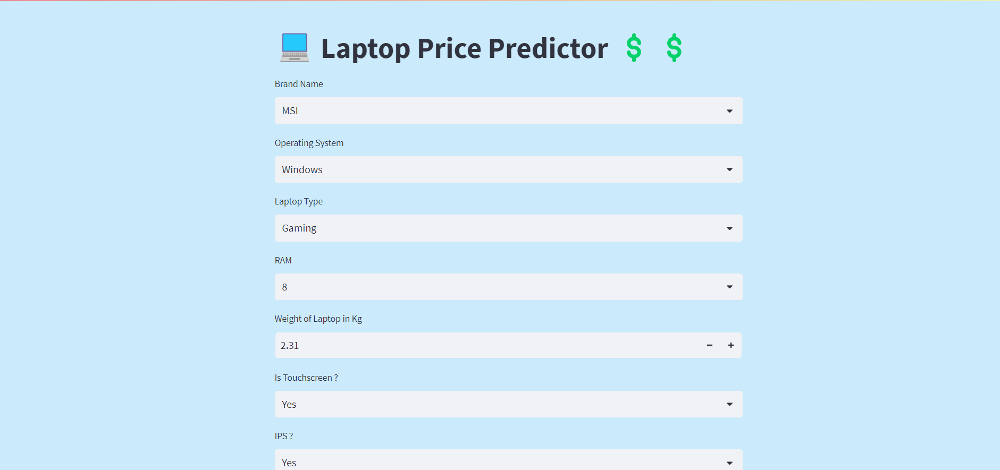
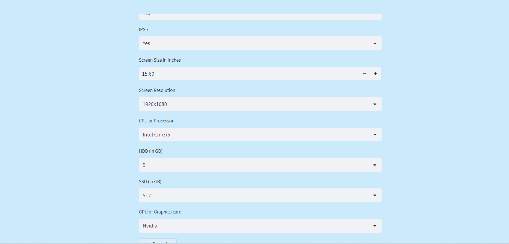
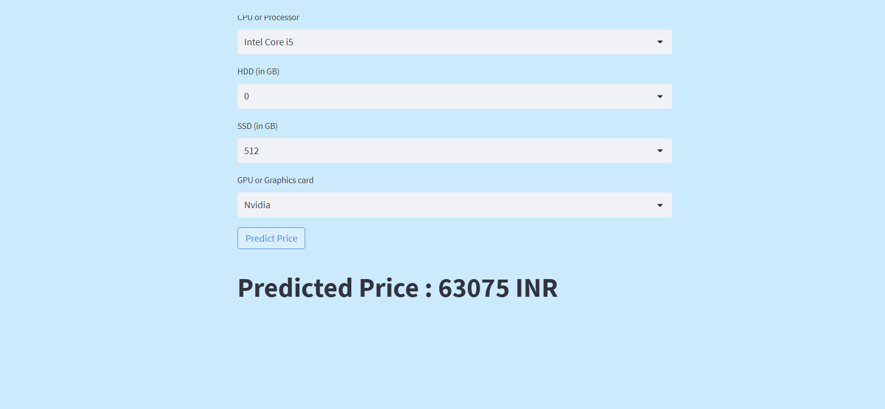

# Idea - 

I was recently learning various machine learning algorithms classification
algorithms as well as regression algorithms. Last night my friend called
me. He want to buy a new laptop with a fix budget. He want me to help him
in purchasing that. He described his requirements and specifications 
and asked me "What would be the price of it". I was not sure about it.
Thus , I got an idea of creating a model which can help us to find the
price of a laptop.

# About -

It is a website created with streamlit and python. A machine learning model
is working as backend to predict the price of laptop.
### Model Type - Regression Model
### Algorithm used - Random Forest
### EDA performed
### DataSet - LapTop_Prices

# Demo prediction of a laptop

## step - 1 fill all required details

## Click on predict button and get the result

